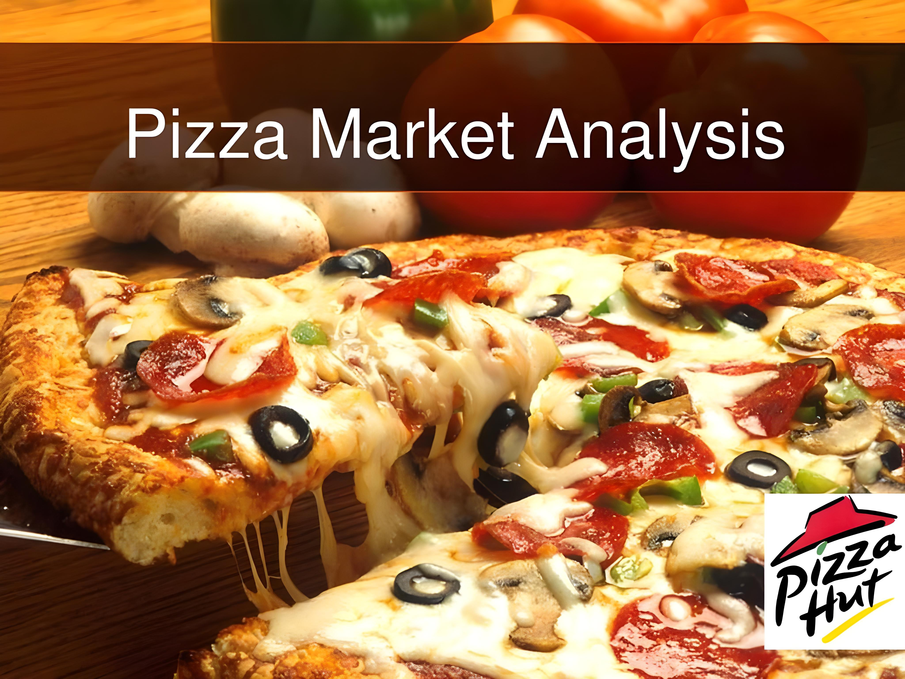

# Pizza-Insights-Data-Driven-Analysis-for-Smarter-Slice-Decisions

## Table of Contents

- [Project Overview](#Project-Overview)
- [Objectives](#Objectives)
- [Project Description](#Project-Description)
- [Technologies Used](#Technologies-Used)
- [📊 Data Overview](#📊-Data-Overview)
- [Key Queries](#Key-Queries)
- [Tools and Technologies Used](#Tools-and-Technologies-Used)

  
## Project Overview

It is a data-driven exploration into the key metrics that shape a pizza store's business. This project dives into order patterns, revenue generation, customer preferences, and peak hours, providing actionable insights for enhancing operational efficiency and customer satisfaction. By analyzing pizza types, sizes, order timing, and ingredient popularity, we uncover trends that can inform strategic decisions, promotional planning, and product offerings.

Whether you’re interested in understanding what drives pizza sales or optimizing a restaurant’s revenue strategy, this analysis delivers valuable perspectives on the performance of various pizzas and customer ordering habits. With powerful SQL queries, we dissect the data to reveal the most ordered items, highest revenue contributors, customer favorites, and much more.

## Objectives

**Quantify Customer Demand:** Calculate total orders, identify popular pizza types and sizes, and analyze customer ordering patterns.

**Maximize Revenue Insights:** Determine top revenue-generating pizzas and track cumulative revenue trends to highlight high-performing products.

**Optimize Product Offerings:** Evaluate which pizza categories and ingredients drive sales, enabling targeted promotions and menu adjustments.

**Analyze Peak Times:** Examine order distribution by time slots to understand peak ordering hours, helping plan staffing and promotional strategies.

**Understand Customer Behavior:** Identify customers with frequent orders and their favorite pizzas to explore loyalty incentives and tailored marketing.

**Support Strategic Planning:** Highlight revenue trends over time, pinpoint high-revenue dates, and assess sales growth to support data-driven business decisions.

## Project Description

project is a deep dive into a pizza store's transactional data to uncover valuable insights for optimizing business operations and customer experience. By leveraging SQL and analytical techniques, this project examines different aspects of pizza orders, including revenue generation, order patterns, and product popularity.

## Technologies Used

- MYSQL Server
- Git
- GitHub
- Markdown

## 📊 Data Overview

The pizaa store dataset comprises four primary tables, each capturing distinct information about the pizza store’s operations and offerings.

## Key Queries

**Order and Revenue Overview:**

The analysis calculates the total number of orders, the overall revenue generated from pizza sales, and identifies the highest-priced pizza, giving a clear picture of the store's performance.

**Popular Pizza Trends:**

The queries identify the most common pizza sizes, the top 5 most ordered pizza types along with their quantities, and the category-wise distribution of pizzas, offering insights into customer preferences.

**Time-Based Insights:**

By analyzing the distribution of orders by hour of the day and categorizing revenue by time slots (morning, afternoon, evening), these queries help uncover peak hours and optimal times for revenue generation.

**Revenue and Growth Analysis:**

 The queries determine revenue distribution across dates, calculate the top pizza types based on revenue, and track the growth rate of sales day-over-day, highlighting trends and opportunities for improvement.

**Customer Behavior and Ingredient Preferences:**

These queries identify repeat customers, their most frequently ordered pizza types, the highest-revenue days, and the sales impact of specific ingredients, such as mushrooms, over time, helping to refine marketing and promotional strategies.

## Tools and Technologies Used:

This project leverages a combination of powerful tools and technologies to analyze, visualize, and derive insights from the pizza store dataset:

**SQL Server:** The core technology for querying and analyzing data stored in the relational database. SQL was used extensively to join tables, aggregate data, and perform complex queries to extract meaningful insights.

**Power BI:** Used for creating interactive and visually appealing dashboards to present key insights from the data, such as total revenue, order trends, and customer behavior. Power BI's powerful data modeling and visualization capabilities allowed for effective analysis and storytelling.

**Tableau:** Another visualization tool used to generate data-driven visuals and reports. Tableau helped in visualizing time-based trends, revenue distribution, and other key metrics to identify patterns and insights that could inform business strategies.

**Git & GitHub:** For version control and collaboration, ensuring the project's codebase is well-managed and up-to-date.

**Markdown:** Employed for creating clean, readable documentation for the project, ensuring a seamless experience for other developers and collaborators.
